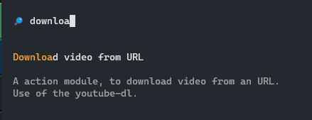
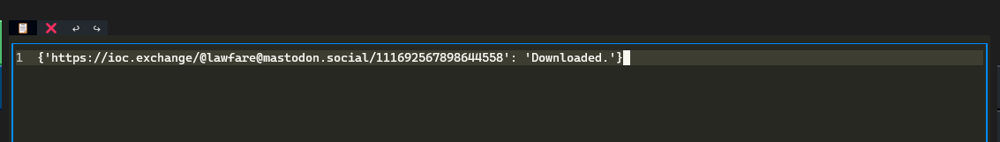

# Goal

This tutorial explain in depth the process to create a new action. We will create a new action for dowloading a video accessible through an URL.

You might need to install `youtube-dl` with this command :

```bash
# Install last version according to :
# https://github.com/ytdl-org/youtube-dl/issues/31530#issuecomment-1435477247

pip install --upgrade --force-reinstall "git+https://github.com/ytdl-org/youtube-dl.git"
```

# Creating the action Class

- Create a new file called `downloadAction.py` in the `userAction/private/` directory of your cyberclip installation.
- Paste this content inside it :

```python
# Import the actionInterface which give common behaviour to all actions
try:
    from userAction.actionInterface import actionInterface
except:
    from actionInterface import actionInterface
import youtube_dl

class downloadVideoAction(actionInterface):
    """A action module, to download video from an URL.
Use of the youtube-dl.
    """
    def __init__(self, parsers = {}, supportedType = {"url"}):
        super().__init__(parsers = parsers, supportedType = supportedType)
        self.description = "Download video from URL"
```

At this time, your new action should already appears in the interface when you search for it in the command palette (`Ctrl+P`) : 



A few things to keep in mind in order to make your action work :

- While importing action, only classes which contains `Action` in their name are imported as action,
- The `supportedType` will indicate in which case your action should be loaded. If you want your action to be always displayed in the terminal user interface (TUI), you might want to indicated your action supports `text` parser,
- The `self.description` value is used by the TUI and is displayed inside the button that triggers the action,
- The `docstring` is displayed inside the TUI command pallette and as a tooltip while hoovering the action button.

# Adding the logic behind the action

Now in order to bring some usefullness to your action, you might want to define what your action do. Here your action should take a link in input and download video from the link. You have to define this behaviour inside the `execute` method.

```python
    def execute(self) -> object:
        self.get_observables()
        self.results = {}
        ydl_opts = {
            'outtmpl': '~/Downloads/%(extractor_key)s/%(extractor)s-%(id)s-%(title)s.%(ext)s',
        }
        for url in self.observables.get("url", []):
            try:
                with youtube_dl.YoutubeDL(ydl_opts) as ydl:
                    ydl.download([url])
                    self.results.update({url:"Downloaded."})
            except Exception as e:
                self.results.update({url:f"Error while downloading : {str(e)}"})
        return self.results
    
    def __str__(self):
        return str(self.execute())
```

- A best practice is to make the `execute` method returning a dict in form of `{"parsed-value":"result of action"}`, this make the action compatible with the table view. 
- The `__str__` method is here to deliver a human readable return on the action, this method is called to display the action result inside the TextArea widget in the TUI. `__str__` should call the `self.execute` method.

